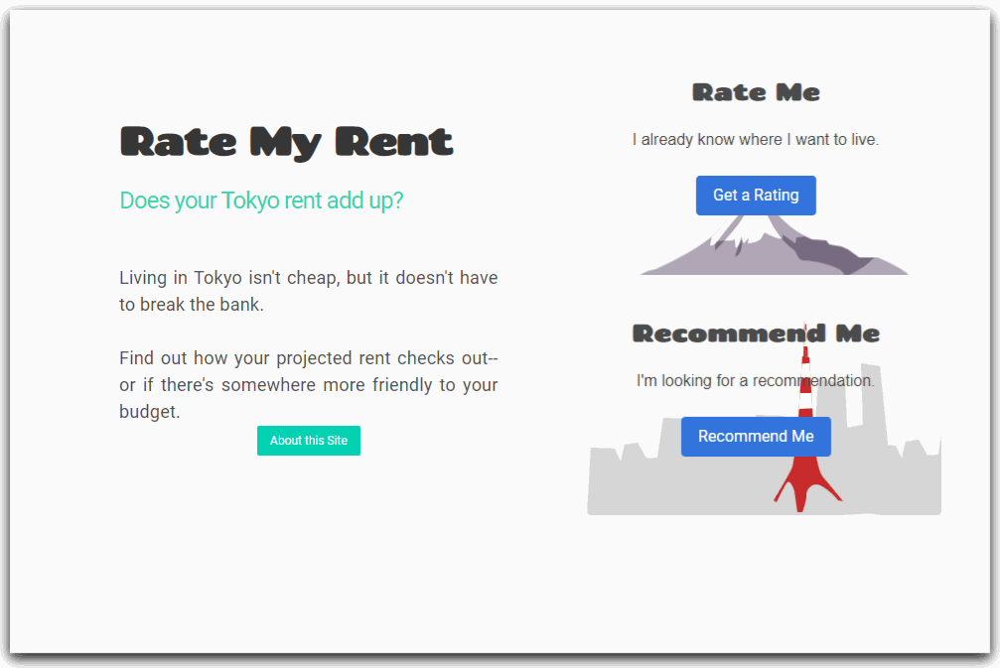
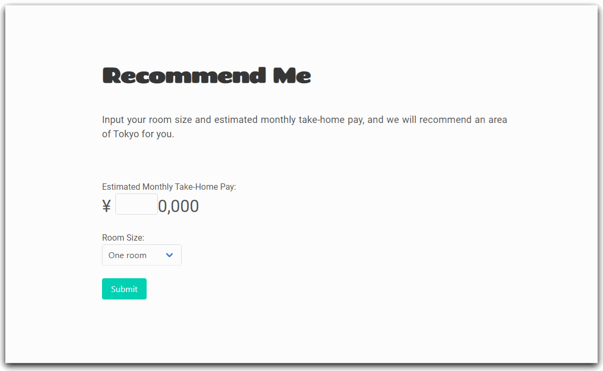

# RateMyRent
A site that takes a user's estimated monthly salary, ideal room size, and the area of Tokyo's 23 wards they want to live in, and gives a rating or recommendation-- for entertainment purposes, of course!

## <a href="https://ratemyrent.herokuapp.com">:house: Live Preview (Click me!) :house:</a>
<a href="https://forms.gle/wk18DwHua6kcD7tt9">Contact me</a><i> if you experience any problems.</i>

---
<i>Rate My Rent</i> is a website that takes a user's estimated monthly salary as well as the room size and area of Tokyo that they wish to live in, and gives a rating or recommendation.

<i>Rate My Rent</i> was created with <b>Python</b> in <b>Flask</b>. It uses a <b>PostgreSQL</b> database. Front-end was created with the help of the <b>Bulma</b> Framework. It was deployed on <b>Heroku</b> with <b>Heroku Postgres</b>.

---
Ratings are based on an assumption of 30% of a user's estimated salary being an ideal percentage to use towards rent, with deviations from that rated accordingly. Data for average rent by area and room size was sourced from <a href="https://suumo.jp/chintai/soba/tokyo/"><b>Suumo</b></a>.

              <i>Receiving a rating based on salary, area, and room-size</i>
              
---

Recommendations use an estimated salary and room size to recommend an area that falls close to 30% of the user's monthly intake.

              <i>Receiving a recommendation</i>
              
---

If the salary is not entered, or is a negative number, an error message is displayed.

              <i>Error messages are displayed above the salary input</i>
              

---
 # :sparkles: Thank you for reading!	:sparkles:
